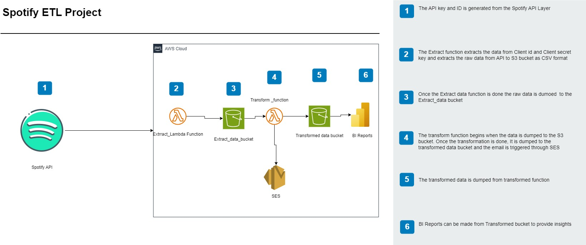

# 🎯 Objective

The primary objective of this project is to process and transform raw Spotify Discover Weekly playlist data into structured formats for generating valuable insights and dashboards. This project aims to simplify handling large-scale playlist data and provide meaningful, actionable insights.

# 🛠 Current Problem and How This Project Solves It

### Problem:
Data engineering workflows often face challenges such as:
- Inconsistent data formats.
- High costs associated with data processing and visualization tools.
- Lack of automation for transforming raw data into insights.

### Solution:
This project addresses these issues by:
- Implementing Python-based ETL pipelines to process raw JSON data into clean CSV files.
- Using cost-effective solutions like AWS S3 for data storage and Power BI for visualization, ensuring minimal or no expenses.
- Automating the transformation and visualization process to reduce manual intervention.

# 🧰 Services Used

The following services and tools are utilized in this project:
- **Spotify API**: For fetching playlist data.
- **AWS S3**: For storing raw and transformed data.
- **AWS SES**: For email notifications and communication.
- **Python**: For writing data extraction, transformation, and loading (ETL) scripts.
- **Pandas**: For efficient data manipulation and processing.
- **Power BI**: For creating dashboards and visualizations.

# 🏗 Architecture Diagram

# 📋 Summary

This project processes Spotify Discover Weekly playlist data, extracts valuable insights, and visualizes them using dashboards. The workflow involves:
1. Extracting raw data from Spotify API.
2. Transforming it into structured formats (CSV files) using Python.
3. Storing the transformed data in S3.
4. Sending email notifications with AWS SES.
5. Using Power BI to build insightful dashboards.

The project is designed to be cost-effective and suitable for individual developers or small teams looking for data insights without incurring high costs.

